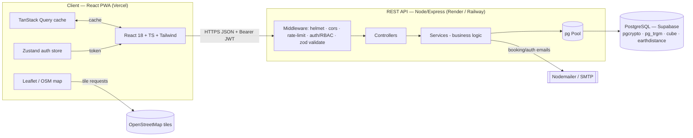
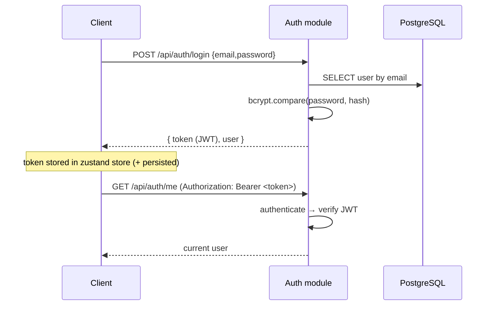
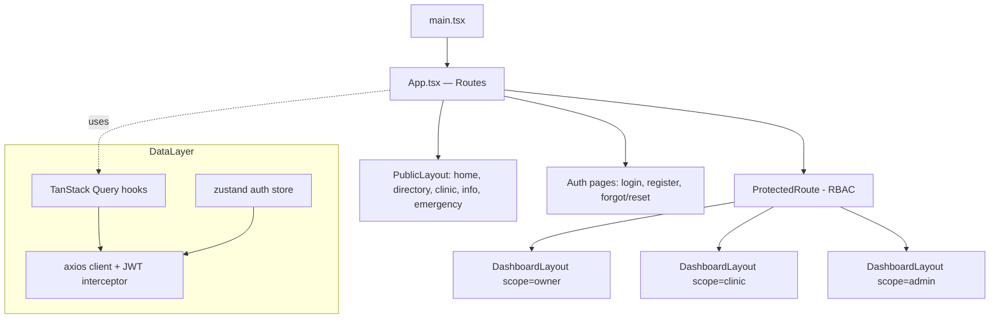
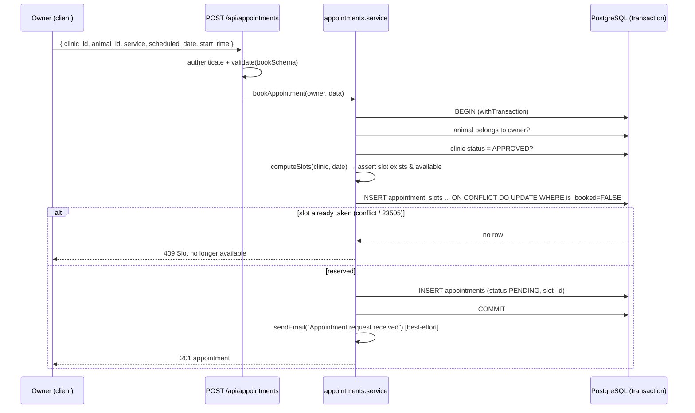

# Architecture — VetConnect Ibafo

This document describes the system architecture of VetConnect Ibafo: the high-level
topology, the layered backend, the frontend architecture, an end-to-end request
lifecycle, the RBAC model, and the notification / reminder strategy.

---

## 1. High-Level Topology



- **Client (PWA):** a single-page React app served as static assets from Vercel. It
  talks to the API over HTTPS, sending a **Bearer JWT** on authenticated requests.
  Maps use Leaflet with OpenStreetMap tiles directly from the browser (no key).
- **REST API:** a stateless Express service. Every request passes a middleware
  pipeline, lands in a controller, which delegates to a service that owns the SQL and
  business rules.
- **PostgreSQL:** the single source of truth (Supabase). Geo proximity uses the
  **Haversine** formula in SQL (with optional `earthdistance` GiST indexing).
- **Email:** transactional email (booking confirmations, status changes, password
  reset) is sent via **Nodemailer** and logged to the `notifications` table.

### JWT Auth Flow



Tokens are signed with `JWT_SECRET`, expire after `JWT_EXPIRES_IN` (default `7d`),
and carry the user id + role. Password-reset tokens are stored hashed on the user row
with an expiry (`JWT_RESET_EXPIRES_IN`).

---

## 2. Layered Backend

The backend is a clean, layered ESM Express application. Boot order: `server.js`
calls `createApp()` (in `app.js`), which wires global middleware and mounts the
central router from `routes/index.js`. Each feature lives in `modules/<name>/`.

```
HTTP request
   │
   ▼
[ Global middleware ]  helmet → cors → json/urlencoded (1mb) → morgan → rate-limit(/api)
   │
   ▼
[ Route ]              modules/<name>/<name>.routes.js
   │  per-route middleware: authenticate · authorize(...roles) · validate(schema)
   ▼
[ Controller ]        modules/<name>/<name>.controller.js   (HTTP req/res, envelopes)
   │
   ▼
[ Service ]           modules/<name>/<name>.service.js       (business rules + SQL)
   │
   ▼
[ DB pool ]           db/pool.js  →  query() / withTransaction()
   │
   ▼
PostgreSQL
```

### Middleware stack
| Middleware | Source | Role |
|-----------|--------|------|
| **helmet** | `app.js` | Security headers (`crossOriginResourcePolicy: cross-origin`) |
| **cors** | `app.js` | Allows configured `CLIENT_URL` origin(s); `credentials: true` |
| **body parsers** | `app.js` | `express.json`/`urlencoded` capped at **1mb** |
| **morgan** | `app.js` | Request logging (dev only) |
| **apiLimiter** | `middleware/rateLimit.js` | Global rate limit on `/api` |
| **authLimiter** | `middleware/rateLimit.js` | Stricter limit on auth endpoints |
| **authenticate** | `middleware/auth.js` | Verifies JWT, attaches `req.user` |
| **optionalAuth** | `middleware/auth.js` | Attaches user if a token is present, else continues as guest |
| **authorize(...roles)** | `middleware/auth.js` | RBAC gate; 403 if role not allowed |
| **validate(schema, where)** | `middleware/validate.js` | Zod validation of `body`/`query`/`params` |
| **notFound / errorHandler** | `middleware/error.js` | 404 + centralised error → JSON envelope |

### Error & response conventions
Services throw a typed `ApiError` (`utils/ApiError.js`) with helpers like
`ApiError.notFound`, `ApiError.forbidden`, `ApiError.conflict`, `ApiError.badRequest`.
The central `errorHandler` converts these to the standard error envelope. Controllers
emit the success envelope `{ success, data, meta }`. See [API.md](API.md).

The app sets `trust proxy = 1` so client IPs (used by rate-limiting) are correct
behind the Render/Railway/Vercel reverse proxies.

---

## 3. Frontend Architecture



- **Vite 5 + React 18 + TypeScript.** Build is `tsc -b && vite build`, output to `dist/`.
- **Routing:** `react-router-dom` v6 with **lazy** route components (`React.lazy` +
  `Suspense`) so the initial mobile bundle is minimal. Route map in `App.tsx`:
  - **Public** (`PublicLayout`): `/`, `/directory`, `/clinics/:slug`, `/info`,
    `/info/:slug`, `/emergency`, `/unauthorized`.
  - **Auth**: `/login`, `/register`, `/forgot-password`, `/reset-password`.
  - **Owner** (`ProtectedRoute roles={['OWNER']}`): `/app/dashboard`, `/app/animals`,
    `/app/appointments`, `/app/book`, `/app/book/:clinicSlug`, `/app/vaccinations`,
    `/app/profile`.
  - **Clinic** (`['CLINIC_ADMIN']`): `/clinic/dashboard`, `/clinic/appointments`,
    `/clinic/availability`, `/clinic/reviews`, `/clinic/profile`, `/clinic/veterinarians`.
  - **Admin** (`['SUPER_ADMIN']`): `/admin/dashboard`, `/admin/clinics`,
    `/admin/users`, `/admin/reviews`, `/admin/articles`, `/admin/emergency`.
  - Fallbacks: `/404` and `*` → redirect to `/404`.
- **Data layer:** **TanStack Query** owns server state (caching, de-duplication,
  background refetch). An **Axios** client injects the Bearer token and handles 401s.
- **Auth state:** a **Zustand** store holds the JWT + current user (persisted), read by
  `ProtectedRoute` to enforce role access (redirecting unauthenticated users to
  `/login` and wrong-role users to `/unauthorized`).
- **Forms:** React Hook Form + Zod resolvers mirror the backend Zod schemas.
- **Design system:** Tailwind CSS tokens (colors, spacing, typography), `clsx` +
  `tailwind-merge` for class composition, `lucide-react` icons, `framer-motion`
  transitions, `react-hot-toast` notifications.
- **Maps / geo:** `react-leaflet` + Leaflet render OSM tiles (`VITE_MAP_TILE_URL`);
  "near me" calls `GET /api/geo/nearby`.
- **PWA:** `vite-plugin-pwa` provides a service worker + manifest for installable,
  offline-tolerant, mobile-first behaviour.

---

## 4. Request Lifecycle — Booking an Appointment

The booking flow is the most safety-critical path because it must **never double-book
a slot**. The logic lives in `modules/appointments/appointments.service.js` and reuses
slot computation from `modules/availability/availability.service.js`.



**Double-booking prevention** has three layers, all inside one transaction:
1. A live re-check that no `PENDING`/`CONFIRMED` appointment already holds
   `(clinic, date, start_time)`.
2. Slot validity: the requested time must appear as `available` in
   `computeSlots(clinic, date)` (derived from `clinic_availability` minus blocks and
   already-booked slots).
3. An atomic reservation insert into `appointment_slots` guarded by the unique
   constraint `uq_slot (clinic_id, vet_id, slot_date, start_time)` with
   `ON CONFLICT ... DO UPDATE ... WHERE is_booked = FALSE`. If no row comes back (or a
   `23505` is raised), the booking fails with **409 Conflict**.

When the clinic later confirms/rejects/reschedules via `PATCH /api/appointments/:id`,
the same service runs a small **state machine** (`PENDING → CONFIRMED → COMPLETED`,
with `CANCELLED`/`NO_SHOW`/reschedule branches), frees the reserved slot on
cancel/reject/no-show, and emails the owner.

---

## 5. RBAC Matrix

Roles: **Guest** (no token), **OWNER**, **CLINIC_ADMIN**, **SUPER_ADMIN**.
Enforced by `authenticate` + `authorize(...roles)` per route; some routes use
`optionalAuth` (work for guests, richer for authenticated users).

| Capability | Guest | OWNER | CLINIC_ADMIN | SUPER_ADMIN |
|-----------|:-----:|:-----:|:------------:|:-----------:|
| Browse directory / clinic profiles | ✅ | ✅ | ✅ | ✅ |
| Geo "near me" search | ✅ | ✅ | ✅ | ✅ |
| Read articles / categories | ✅ | ✅ | ✅ | ✅ |
| Submit emergency request | ✅ | ✅ | ✅ | ✅ |
| View emergency contacts | ✅ | ✅ | ✅ | ✅ |
| Register / login | ✅ | — | — | — |
| Manage own animals | ❌ | ✅ | ❌ | ❌ |
| Book / cancel / reschedule appointment | ❌ | ✅ | ↺* | ↺* |
| Confirm / reject / complete / no-show appt | ❌ | ❌ | ✅ | ✅ |
| Manage vaccinations (own animals) | ❌ | ✅ | ❌ | ❌ |
| Create a clinic | ❌ | ✅ | ✅ | ❌ |
| Update clinic | ❌ | own | own | ✅ all |
| Manage clinic availability / blocks | ❌ | ❌ | own | ✅ |
| Manage veterinarians | ❌ | ❌ | ✅ | ✅ |
| Verify veterinarian | ❌ | ❌ | ❌ | ✅ |
| Approve/reject/suspend clinic | ❌ | ❌ | ❌ | ✅ |
| Post a review | ❌ | ✅ | ❌ | ❌ |
| Respond to a review | ❌ | ❌ | ✅ (own clinic) | ✅ |
| Moderate reviews | ❌ | ❌ | ❌ | ✅ |
| List/triage emergency requests | ❌ | ❌ | ✅ | ✅ |
| Manage users | ❌ | ❌ | ❌ | ✅ |
| Author articles / categories | ❌ | ❌ | ❌ | ✅ |
| View analytics | ❌ | owner | clinic | admin |

`*` Clinic/admin reschedule is allowed on appointments they participate in; the
appointment state machine restricts which transitions each role may perform.
`own` = limited to records the user owns (enforced in the service layer, e.g.
`clinic.owner_id = req.user.id`).

---

## 6. Notifications & Vaccination Reminders

### Notification strategy
- All transactional messages (booking received, confirmation, rejection, reschedule,
  password reset) are sent **best-effort** via Nodemailer and **logged** to the
  `notifications` table (`channel`, `subject`, `body`, `payload`, `status`).
- The `notifications` table is **channel-agnostic** — `notification_channel` enum
  already includes `EMAIL`, `SMS`, `WHATSAPP`, `IN_APP`, and `notification_status`
  tracks `QUEUED / SENT / FAILED / READ`. This means the in-app notification feed and
  email share one log.
- Email sending failures never block the API response (`.catch(() => {})`); the failed
  status is recorded for later retry/observability.
- The frontend polls `GET /api/notifications/unread-count` and renders the feed from
  `GET /api/notifications`, with `PATCH /:id/read` and `PATCH /read-all`.

### Vaccination reminders
- Each `vaccinations` row has a `due_date`, optional `reminder_date`, and a
  `vaccination_status` (`UPCOMING / DUE / OVERDUE / COMPLETED`).
- Owners view and manage reminders under `/app/vaccinations`; the module also exposes
  `GET /api/vaccinations/suggestions` to propose a schedule by species.
- Statuses are computed against `due_date`, so the owner dashboard surfaces what is due
  or overdue.

### Future SMS / WhatsApp readiness
The schema and notification log were deliberately designed multi-channel. Adding SMS or
WhatsApp later is a matter of implementing an additional transport in the mailer/notify
utility and writing rows with `channel = 'SMS'` / `'WHATSAPP'` — no schema change is
required. This matters for the target audience, who are smartphone-primary and reachable
via SMS/WhatsApp even when email is impractical.
</content>
