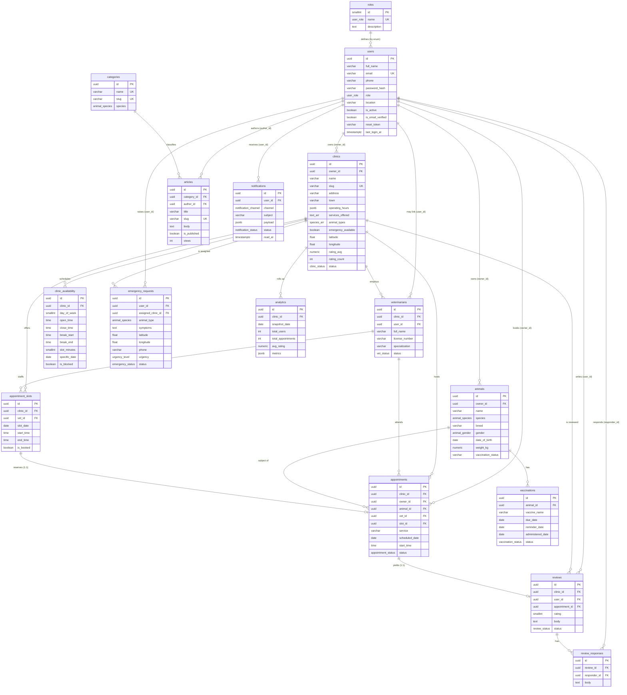

# Entity-Relationship Documentation — VetConnect Ibafo

Source of truth: `backend/src/db/schema.sql` (PostgreSQL 14+, Supabase-compatible).

- **Primary keys:** UUID (`gen_random_uuid()` via `pgcrypto`), except `roles` (SMALLINT).
- **Conventions:** snake_case identifiers, `created_at` / `updated_at` audit columns on
  mutable tables (maintained by the `set_updated_at()` BEFORE-UPDATE trigger), and
  explicit `ON DELETE` rules on every foreign key.
- **Extensions:** `pgcrypto`, `pg_trgm` (trigram text search), `cube`, `earthdistance`
  (geo indexing via `ll_to_earth`).

---

## ER Diagram

---

## Enum Types

| Enum | Values |
|------|--------|
| `user_role` | `OWNER`, `CLINIC_ADMIN`, `SUPER_ADMIN` |
| `clinic_status` | `PENDING`, `APPROVED`, `REJECTED`, `SUSPENDED` |
| `vet_status` | `PENDING`, `VERIFIED`, `REJECTED` |
| `animal_species` | `DOG`, `CAT`, `POULTRY`, `GOAT`, `SHEEP`, `CATTLE`, `RABBIT`, `OTHER` |
| `animal_gender` | `MALE`, `FEMALE`, `UNKNOWN` |
| `appointment_status` | `PENDING`, `CONFIRMED`, `COMPLETED`, `CANCELLED`, `NO_SHOW` |
| `vaccination_status` | `DUE`, `UPCOMING`, `COMPLETED`, `OVERDUE` |
| `emergency_status` | `OPEN`, `ASSIGNED`, `RESOLVED`, `CANCELLED` |
| `urgency_level` | `LOW`, `MODERATE`, `HIGH`, `CRITICAL` |
| `review_status` | `PUBLISHED`, `PENDING`, `HIDDEN`, `FLAGGED` |
| `notification_channel` | `EMAIL`, `SMS`, `WHATSAPP`, `IN_APP` |
| `notification_status` | `QUEUED`, `SENT`, `FAILED`, `READ` |

---

## Table Reference

### 1. `roles`
Reference table mirroring the `user_role` enum for RBAC reporting. SMALLINT PK,
`name` is unique. Seeded with `(1 OWNER)`, `(2 CLINIC_ADMIN)`, `(3 SUPER_ADMIN)`.

### 2. `users`
All accounts across the three roles. Key columns: `email` (UNIQUE), `password_hash`
(bcrypt), `role`, `location` (Ibafo/Mowe/Magboro…), `is_active`, `is_email_verified`,
`reset_token` + `reset_token_expires` (password reset), `last_login_at`.
**Indexes:** `LOWER(email)`, `role`. **Trigger:** `set_updated_at`.

### 3. `clinics`
Veterinary clinic profiles. **FK** `owner_id → users(id) ON DELETE SET NULL`
(the clinic admin). Notable columns: `slug` (UNIQUE), `town`, `operating_hours` (JSONB),
`services_offered` (TEXT[]), `animal_types` (species[]), `emergency_available`,
`latitude`/`longitude`, denormalised `rating_avg` + `rating_count`, and `status`
(`clinic_status`). **Indexes:** owner, status, town, emergency, `rating_avg DESC`,
GIN trigram on `name`, GiST `ll_to_earth(latitude,longitude)`. **Trigger:** `set_updated_at`.

### 4. `veterinarians`
Vets on a clinic's staff. **FKs:** `clinic_id → clinics(id) ON DELETE CASCADE`,
`user_id → users(id) ON DELETE SET NULL`. Columns: `full_name`, `license_number`,
`specialization`, `bio`, `status` (`vet_status` — `SUPER_ADMIN` verifies).
**Indexes:** clinic, status. **Trigger:** `set_updated_at`.

### 5. `animals`
Owner's pets and livestock. **FK** `owner_id → users(id) ON DELETE CASCADE`.
Columns: `species`, `breed`, `gender`, `date_of_birth`, `age_years`, `weight_kg`,
`color`, `vaccination_status`, `medical_notes`. **Indexes:** owner, species.
**Trigger:** `set_updated_at`.

### 6. `clinic_availability`
Recurring weekly rules **and** one-off date blocks that drive slot generation.
**FK** `clinic_id → clinics(id) ON DELETE CASCADE`. Columns: `day_of_week` (0=Sun..6=Sat,
NULL for date-specific rows), `open_time`/`close_time`, `break_start`/`break_end`,
`slot_minutes` (default 30), `specific_date` + `is_blocked` + `reason` (holidays/closures).
**Indexes:** clinic, `(clinic_id, day_of_week)`, `(clinic_id, specific_date)`.
**Trigger:** `set_updated_at`.

### 7. `appointment_slots`
Materialised bookable slots; the mechanism that **prevents double-booking**.
**FKs:** `clinic_id → clinics ON DELETE CASCADE`, `vet_id → veterinarians ON DELETE SET NULL`.
Columns: `slot_date`, `start_time`, `end_time`, `is_booked`. **Unique constraint**
`uq_slot (clinic_id, vet_id, slot_date, start_time)` enforces one slot per
clinic/vet/datetime. **Indexes:** `(clinic_id, slot_date)`, `(clinic_id, slot_date, is_booked)`.

### 8. `appointments`
Bookings and their lifecycle. **FKs:** `clinic_id`, `owner_id`, `animal_id` →
`ON DELETE CASCADE`; `vet_id → veterinarians ON DELETE SET NULL`;
`slot_id → appointment_slots ON DELETE SET NULL` and **UNIQUE** (one appointment per slot).
Columns: `service`, `scheduled_date`, `start_time`/`end_time`, `status`
(`appointment_status`), `notes`, `reject_reason`. **Indexes:** clinic, owner, animal,
status, scheduled_date. **Trigger:** `set_updated_at`.

### 9. `reviews`
Owner ratings of clinics. **FKs:** `clinic_id → clinics ON DELETE CASCADE`,
`user_id → users ON DELETE CASCADE`, `appointment_id → appointments ON DELETE SET NULL`.
`rating` SMALLINT with `CHECK (rating BETWEEN 1 AND 5)`, `body`, `images` (TEXT[]),
`status` (`review_status`). **Unique** `uq_review_per_appt (appointment_id)` — one review
per completed appointment. **Indexes:** clinic, user, status. **Triggers:** `set_updated_at`
**and** the rating-maintenance trigger (see below).

### 10. `review_responses`
Clinic-admin replies to reviews. **FKs:** `review_id → reviews ON DELETE CASCADE`,
`responder_id → users ON DELETE CASCADE`. Column `body` (required).
**Index:** review. **Trigger:** `set_updated_at`.

### 11. `categories`
Article taxonomy. `name` and `slug` both UNIQUE; optional `species` association.
**Index:** species.

### 12. `articles`
Preventive-care information portal. **FKs:** `category_id → categories ON DELETE SET NULL`,
`author_id → users ON DELETE SET NULL`. Columns: `title`, `slug` (UNIQUE), `excerpt`,
`body`, `tags` (TEXT[]), `is_published`, `views`. **Indexes:** category, is_published,
GIN trigram on `title`, GIN on `tags`. **Trigger:** `set_updated_at`.

### 13. `vaccinations`
Per-animal vaccination records & reminders. **FK** `animal_id → animals ON DELETE CASCADE`.
Columns: `vaccine_name`, `due_date`, `reminder_date`, `administered_date`, `status`
(`vaccination_status`), `notes`. **Indexes:** animal, due_date, status. **Trigger:** `set_updated_at`.

### 14. `emergency_requests`
Emergency assistance (guests allowed). **FKs:** `user_id → users ON DELETE SET NULL`,
`assigned_clinic_id → clinics ON DELETE SET NULL`. Columns: `animal_type`, `symptoms`,
`location_text`, `latitude`/`longitude`, `phone` (required), `urgency` (`urgency_level`),
`status` (`emergency_status`), `resolved_note`. **Indexes:** status, assigned clinic,
user. **Trigger:** `set_updated_at`.

### 15. `notifications`
Channel-agnostic notification/email log. **FK** `user_id → users ON DELETE CASCADE`.
Columns: `channel`, `subject`, `body`, `payload` (JSONB), `status`, `error`, `sent_at`,
`read_at`. **Indexes:** user, status. (No `updated_at`/trigger — append-mostly log.)

### 16. `analytics`
Daily rollup snapshots for dashboards. **FK** `clinic_id → clinics ON DELETE CASCADE`
(NULL = platform-wide). Columns: `snapshot_date`, `total_users`, `total_clinics`,
`total_appointments`, `appointments_today`, `total_patients`, `emergency_count`,
`avg_rating`, `metrics` (JSONB). **Unique** `uq_analytics (clinic_id, snapshot_date)`.
**Indexes:** clinic, snapshot_date.

---

## Rating-Maintenance Trigger

`clinics.rating_avg` and `clinics.rating_count` are **denormalised** for fast directory
sorting and avoid expensive runtime averaging. They are kept in sync by a trigger:

- `refresh_clinic_rating(p_clinic UUID)` recomputes `AVG(rating)` (rounded to 1 dp) and
  `COUNT(*)` over `reviews` where `status = 'PUBLISHED'` for that clinic.
- `trg_reviews_rating` fires **AFTER INSERT OR UPDATE OR DELETE** on `reviews` and calls
  the refresh for the affected `clinic_id`.

This guarantees ratings stay correct as reviews are posted, moderated (status change), or
removed — without application code touching the aggregates.
</content>
